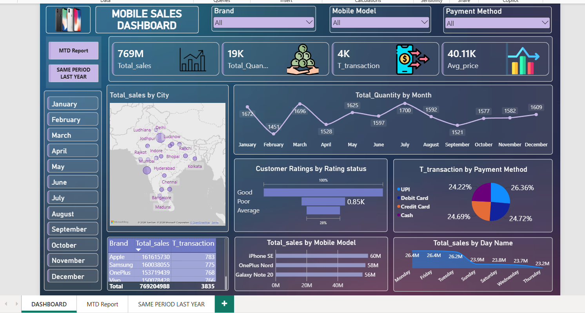

# 📊 Mobile Sales Analytics Dashboard | Power BI

An interactive Power BI dashboard developed to analyze mobile sales performance and identify important business trends.

## 🛠️ Tools & Technologies

- Power BI
- DAX
- Power Query
- Data Analysis
- Data Visualization

## 📈 Key Metrics

- Total Sales
- Total Quantity
- Total Transactions
- Average Price

## 🔍 Analysis Performed

- Sales by Brand
- Sales by Mobile Model
- Sales by City
- Sales by Payment Method
- Customer Rating Analysis
- Monthly Sales Trends
- Daily Sales Trends
- MTD (Month-to-Date) Analysis
- Same Period Last Year Analysis
- Year, Quarter and Month Comparison

## ⭐ Dashboard Features

- Interactive slicers
- KPI cards
- Dynamic charts and tables
- Time-based analysis
- MTD reporting
- Year-over-Year comparison
- Interactive data visualization

## 📷 Dashboard Preview

### Main Dashboard

### MTD Report

### Same Period Last Year

## 📁 Project File

The Power BI `.pbix` file is included in this repository.

## 🎯 Project Objective

The objective of this project is to analyze mobile sales data and provide an interactive dashboard that helps understand sales performance, customer behavior, product performance and time-based trends.

## 👨‍💻 Skills Demonstrated

Power BI | DAX | Power Query | Data Visualization | Data Analysis
